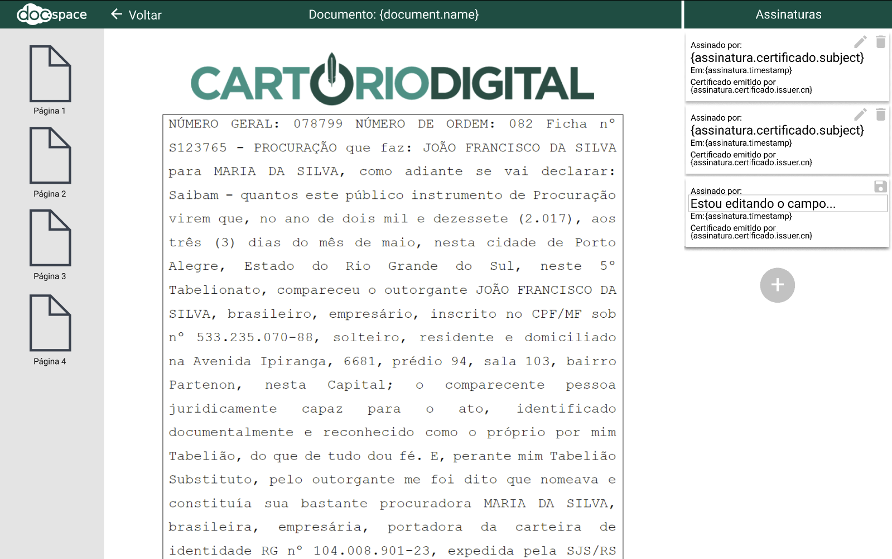

# Bem vindo, candidato!

Para nós da Doc.Space é muito legal saber que você está interessado em trabalhar conosco!

Somos uma startup. Cultivamos o espírito de liberdade e da busca constante pela inovação como forma de tornar as pessoas mais felizes, pois acreditamos que ter um propósito é essencial para uma startup. Assumimos compromissos e abraçamos os riscos pois acreditamos na nossa capacidade, que vem da união de nosso time e da comunhão de nossos propósitos.

Esperamos que vocês tenha sucesso neste pequeno teste que preparamos.

Vamos lá!

# Qual o objetivo desse teste?

Bem, na Doc.Space, mais do que a experiência, valorizamos duas características nas pessoas que integram nosso time:
1. Ser do bem!
2. Ser bom no que faz!

Assim, não interessa se vocês conhece todas as tecnologias que existem... Se não fores do bem e bom no que fazes, de nada adiantará. Gostamos de trabalhar com pessoas do bem, que consigam manter nosso time coeso e motivado. E com pessoas boas no que fazem, o que inclui aprender coisas novas e saber aplicar esses novos conhecimentos.

Nesse pequeno teste, vamos testar se vocês é bom no que faz! Agora, se você é do bem, descobriremos pessoalmente... 😉

# Qual é o teste?

Vocês deverá implementar a tela a seguir.

## User stories

Cada uma das user stories está relacionada a uma issue que contém o detalhamento dos requisitos.

[01. Como um usuário, quero listar meus documentos.](../../issues/6)

[02. Como um usuário, quero exibir um documento.](../../issues/1)

[03. Como um usuário, quero alterar a ordem na qual as assinaturas de um documento são exibidas.](../../issues/2)

[04. Como um usuário, quero editar os campos de uma assinatura.](../../issues/3)

[05. Como um usuário, quero excluir uma assinatura de um documento.](../../issues/4)

[06. Como um usuário, quero inserir uma nova assinatura em um documento.](../../issues/5)

## Arquitetura da solução

